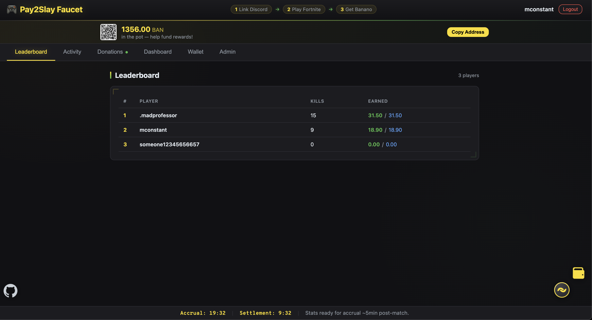
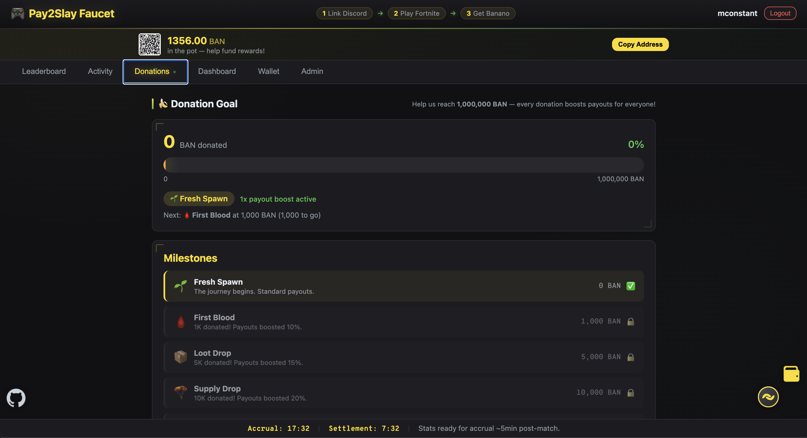

# Pay2Slay

<p align="center">
  
</p>

<p align="center">
  <strong>Earn Banano for Fortnite kills.</strong><br/>
  A cryptocurrency faucet that pays players in BAN for every elimination.
</p>

<p align="center">
  
  
  
  
</p>

---

## Screenshots

| Leaderboard | Donations |
|:-----------:|:---------:|
|  |  |

## How It Works

1. **Login with Discord** — OAuth authenticates you, Yunite maps your Discord to your Epic Games account.
2. **Link your Banano wallet** — Paste your `ban_` address (Kalium, Banano Vault, etc.).
3. **Play Fortnite** — The scheduler tracks your kills and pays you **0.05 BAN per kill** (base rate), auto-settled to your wallet.

Payouts are dynamically adjusted by a **sustainability factor** and **donation milestones**. Daily and weekly kill caps keep the fund healthy.

## Features

- **Live leaderboard** with kill counts, earnings, and activity feed
- **Donation milestones** — 10 tiers from Fresh Spawn (1.0x) to Potassium Singularity (1.5x) with a 10K BAN goal
- **Sustainability factor** — dynamic payout adjustment based on donate-to-leach ratio
- **Transparent economics** — live formula breakdown shown on the Donations page
- **Daily/weekly payout caps** (100 / 500 kills) with abuse detection heuristics
- **Admin panel** — scheduler control, payout config, operator seed management, audit log
- **Demo mode** — full dry-run with seeded data for local testing
- **Supply chain security** — Cosign-signed images, SBOM attestation, digest verification

## Faucet Economics

Pay2Slay uses a self-balancing payout formula to keep the faucet sustainable:

```
effective_rate = base_rate × milestone_multiplier × sustainability_factor
```

| Parameter | Value | Notes |
|-----------|-------|-------|
| Base rate | **0.05 BAN/kill** | Configured in `payout.yaml` |
| Daily kill cap | **100 kills** (≈5 BAN/day) | Per-player limit |
| Weekly kill cap | **500 kills** (≈25 BAN/week) | Per-player limit |
| Seed fund | **1,337 BAN** | Initial operator-funded balance |
| Donation goal | **10,000 BAN** | Unlocks all milestone tiers |

### Sustainability Factor

The sustainability factor automatically adjusts payouts based on the ratio of inflow (seed fund + donations) to outflow (total paid out):

```
sustainability = clamp((seed_fund + total_donated) / total_paid_out, 0.1, 2.0)
```

- **≥ 1.0x** (green) — Donations keeping pace or ahead; full or bonus payouts
- **0.5–1.0x** (amber) — Payouts outpacing donations; rate reduced
- **< 0.5x** (red) — Fund draining; significant rate reduction to extend lifetime

### Milestone Tiers

| Tier | Threshold | Multiplier |
|------|-----------|------------|
| 🌱 Fresh Spawn | 0 BAN | 1.00x |
| 🩸 First Blood | 100 BAN | 1.05x |
| 📦 Loot Drop | 500 BAN | 1.10x |
| 🪂 Supply Drop | 1,000 BAN | 1.15x |
| ⛈️ Storm Surge | 2,500 BAN | 1.20x |
| 🛩️ Airdrop Inbound | 5,000 BAN | 1.25x |
| 👑 Victory Royale | 10,000 BAN | 1.30x |
| 💎 Mythic Rarity | 25,000 BAN | 1.40x |
| 🐒 The Monke Awakens | 50,000 BAN | 1.45x |
| 🍌 Potassium Singularity | 100,000 BAN | 1.50x |

All economics data is displayed transparently on the Donations page, including the live formula, sustainability gauge, and fund breakdown.

## Quick Start

```bash
git clone https://github.com/mconstant/pay2slay2.git && cd pay2slay2
python3 -m venv .venv && source .venv/bin/activate
pip install -e '.[dev]'

# Terminal 1: API server
make api        # http://localhost:8000

# Terminal 2: Scheduler
make scheduler  # metrics on :8001
```

Runs in **dry-run mode** by default — no real API keys or BAN needed for local dev. See [docs/quickstart.md](docs/quickstart.md) for full setup.

## Configuration

YAML configs in `configs/`:

| File | Controls |
|------|----------|
| `payout.yaml` | `ban_per_kill`, `daily_payout_cap`, `weekly_payout_cap`, `seed_fund_ban`, scheduler interval |
| `integrations.yaml` | Banano RPC, Discord OAuth, Yunite, Fortnite API, abuse heuristics |
| `product.yaml` | App name, feature flags, Discord invite URL |

Key environment variables:

| Variable | Default | Notes |
|----------|---------|-------|
| `DATABASE_URL` | `sqlite:///pay2slay.db` | PostgreSQL supported for prod |
| `P2S_DRY_RUN` | `true` | Set `false` for real payouts |
| `SESSION_SECRET` | `dev-secret` | **Change in production** |
| `P2S_INTERVAL_SECONDS` | `1200` | Scheduler loop interval |
| `P2S_METRICS_PORT` | `8001` | Prometheus metrics |

## Make Targets

| Target | Action |
|--------|--------|
| `make api` | Start API with uvicorn --reload |
| `make scheduler` | Start scheduler loop |
| `make test` | Run pytest |
| `make lint` | Run ruff |
| `make type` | Run mypy |
| `make all` | lint + type + test |
| `make ci` | Full CI pipeline |

## Deploy (Akash Network)

Single container on [Akash](https://akash.network) running both API + scheduler. Banano transactions use the public Kalium RPC — no self-hosted node required.

### Prerequisites

1. Akash wallet with AKT ([Keplr setup](#akash-wallet-setup))
2. GitHub CLI (`gh auth login`)
3. Domain with DNS you control

### GitHub Secrets

| Secret | Description |
|--------|-------------|
| `AKASH_MNEMONIC` | 24-word wallet mnemonic |
| `AKASH_CERT` | TLS client cert (via `rotate-akash-cert` workflow) |
| `GH_PAT` | GitHub PAT with `repo` scope |
| `SESSION_SECRET` | `openssl rand -hex 32` |
| `DISCORD_CLIENT_ID` | Discord OAuth app |
| `DISCORD_CLIENT_SECRET` | Discord OAuth app |
| `DISCORD_REDIRECT_URI` | `https://yourdomain.com/auth/discord/callback` |
| `YUNITE_API_KEY` | Epic account resolution |
| `FORTNITE_API_KEY` | fortnite-api.com key |

### GitHub Variables

| Variable | Description |
|----------|-------------|
| `AKASH_ACCOUNT_ADDRESS` | Your `akash1...` address |
| `AKASH_CERT_ID` | Set by rotate-cert workflow |
| `YUNITE_GUILD_ID` | Discord server ID |
| `P2S_OPERATOR_ACCOUNT` | Operator `ban_` address |
| `ADMIN_DISCORD_USERNAMES` | Comma-separated admin usernames |

### Deploy

```bash
gh workflow run deploy-akash.yml -f domain_name=pay2slay.cc -f image_tag=latest
```

Point your domain CNAME to the Akash provider hostname from the workflow output. TLS is handled automatically via Let's Encrypt.

### Docker (local)

```bash
docker build -t pay2slay:dev .
docker run -p 8000:8000 --env-file .env pay2slay:dev
```

Set `PAY2SLAY_AUTO_MIGRATE=1` to run Alembic migrations on startup.

### Akash Wallet Setup

1. Install [Keplr](https://www.keplr.app/) and save your 24-word mnemonic.
2. Enable Akash Network in Keplr.
3. Fund with AKT via exchange or [Osmosis](https://app.osmosis.zone) IBC swap.

### Certificate Rotation

```bash
make rotate-akash-cert
```

### Supply Chain Security

Images are signed with Cosign (keyless/Sigstore) and attested with SBOM (Syft/SPDX). Rollback workflow reuses existing images without rebuild.

## Tech Stack

| Layer | Technology |
|-------|-----------|
| Backend | Python 3.13, FastAPI, SQLAlchemy, Alembic |
| Database | SQLite (dev), PostgreSQL (prod) |
| Blockchain | Banano via bananopie / Kalium RPC |
| Auth | Discord OAuth + Yunite Epic mapping |
| Stats | Fortnite API (fortnite-api.com) |
| Observability | Prometheus, OpenTelemetry |
| Deploy | Docker, Akash Network, Terraform |
| Security | Cosign, Syft SBOM, digest guards |

## Docs

| Doc | Description |
|-----|-------------|
| [Quickstart](docs/quickstart.md) | Full local setup guide |
| [API Reference](docs/api.md) | All endpoints |
| [Data Model](docs/data-model.md) | Database schema |
| [Runbook](docs/runbook.md) | Production operations |
| [Privacy Policy](docs/PRIVACY.md) | Data handling |
| [Security](SECURITY.md) | Vulnerability reporting, hardening |
| [Contributing](CONTRIBUTING.md) | Dev workflow, code style |

## License

[MIT](LICENSE)
